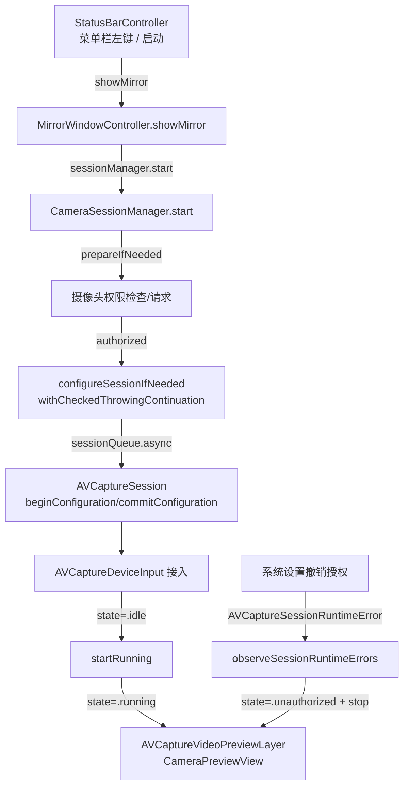
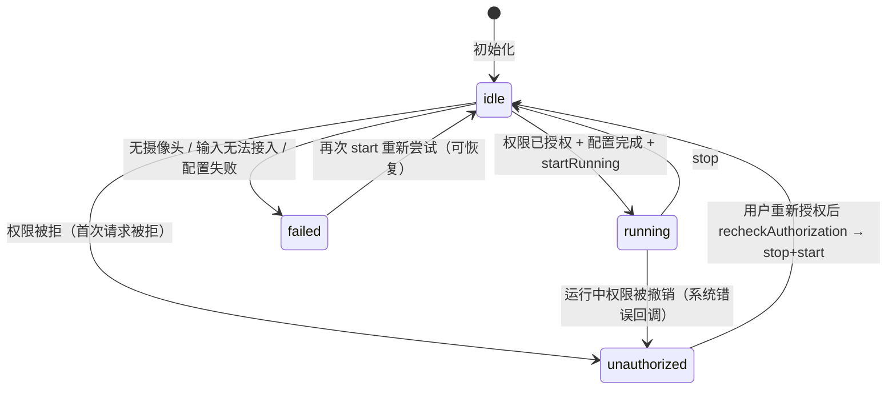

# 摄像头采集与权限 领域知识库

## §0 目录索引

| § | 标题 | 定位 |
|---|------|------|
| §1 | 业务背景与核心概念 | 首次接触该域时读 |
| §1.5 | 架构概览 | 快速建立分层认知（mermaid 图） |
| §2 | 核心业务流程 / 状态机 | 理解权限与采集状态流转 |
| §2.5 | 物理路径速查 | 直接定位代码目录（可 glob/ls） |
| §3 | 代码入口索引 | 按任务场景找入口 |
| §4 | 持久化入口索引 | 改偏好存储 key 时 |
| §5 | 系统事件入口索引 | 改通知监听 / 权限恢复时 |
| §6 | 核心业务规则与隐性约束 | 改代码前必扫的 AI 易错点 |
| §7 | 验证路径 | 改完后如何验证正确性 |
| §8 | 关联文档 | 跨域联读指引 |
| §9 | 覆盖度与待补充项 | 了解文档置信度和缺口 |

## §1 业务背景与核心概念

Mirror 的核心数据来源：通过 AVFoundation 的采集会话（AVCaptureSession）连接前置摄像头，把实时画面交给预览层（`AVCaptureVideoPreviewLayer`）渲染。本域负责：

- 摄像头权限（camera authorization）的请求、检查与降级处理；
- 采集会话（AVCaptureSession）的配置与启停；
- 摄像头设备选择（优先内置广角前置、桌面视角摄像头、连续互通摄像头、外接）；
- 水平镜像偏好（isMirrored）的存储与切换；
- 系统级运行时错误的识别与降级（尤其「用户在系统设置撤销授权」场景）。

核心概念与主称谓：

- 摄像头权限（camera authorization）：系统对摄像头访问的授权状态，值域 authorized / notDetermined / denied / restricted。
- 采集会话（AVCaptureSession）：AVFoundation 采集管道，代码实体 `CameraSessionManager.session`。
- 采集状态（state）：应用自己的状态机，见 §2。
- 水平镜像（isMirrored）：画面左右翻转偏好，默认开启，存 UserDefaults（别名：镜像偏好 / mirroring，菜单栏叫「水平镜像」）。

本域是产品核心循环（打开镜像 → 出画面）的物理基础，其余两个域（镜像窗口、菜单栏）都围绕它工作。

## §1.5 架构概览

采集域采用「UI 域（MainActor） ↔ 后台采集队列（sessionQueue） ↔ AVFoundation」三层结构，跨线程边界只有两处：`session` 对象和 `sessionQueue` 队列。

状态机视角：

## §2 核心业务流程 / 状态机

### 采集状态（`CameraSessionManager.State`）

`@MainActor` 隔离的枚举，只允许在主线程读写：

| 状态 | 含义 | 进入方式 | 退出方式 |
|------|------|---------|---------|
| `idle` | 未采集、未失败 | 初始态；`configureSessionIfNeeded()` 成功后；`stop()` 从 running 转回 | → running / unauthorized / failed |
| `unauthorized` | 摄像头权限被拒或运行中被撤销 | `prepareIfNeeded()` 权限非 authorized；`observeSessionRuntimeErrors()` 识别到 `contentIsNotAuthorized` | 仅 `recheckAuthorization()` 在系统已授权时 stop+start 恢复 |
| `running` | 采集会话正在运行 | `start()` 内 `session.startRunning()` 成功 | `stop()` → idle；运行错误 → unauthorized |
| `failed(String)` | 配置或设备错误 | `configureSessionIfNeeded()` 抛错（无摄像头 / 无法接入输入） | 再次 `start()` 重新走配置 |

### 启动主流程（`start()`）

1. `Task { @MainActor }` 中先 `prepareIfNeeded()`：
   - 权限已授权 → `configureSessionIfNeeded()`
   - 权限未决（notDetermined）→ `requestAccess`，授权后配置，拒绝则 `state = .unauthorized`
   - 其余（denied/restricted）→ `state = .unauthorized`
2. 若状态已是 `unauthorized` / `failed` → 直接返回（不启动）。
3. `sessionQueue.async` 上 `session.startRunning()`（`guard !session.isRunning` 防重复启动），完成后切回主线程置 `state = .running`。

### 停止流程（`stop()`）

1. `sessionQueue.async` 上 `session.stopRunning()`（`guard session.isRunning`）。
2. 主线程若状态是 `.running` → 置 `.idle`。

### 权限恢复流程（`recheckAuthorization()`）

仅当当前状态是 `.unauthorized`，且系统权限已变成 `.authorized` **或** `.notDetermined`（例如 `tccutil reset`）时生效：先 `stop()` 再 `start()`，由 `prepareIfNeeded()` 配置或重新弹窗。若仍是 `.denied` / `.restricted` 则保持降级态。

`configureSessionIfNeeded()` 在 `isConfigured == true` 时若仍停在 `.unauthorized`，会先回到 `.idle`，避免「已授权但 start() 因 unauthorized 直接 return」的死锁。

触发入口（菜单栏 `LSUIElement` 经常收不到 active，悬浮窗也常一直可见不会再走 `onAppear`，故不单靠前台通知）：

- `AppDelegate` 观察 `NSApplication.didBecomeActiveNotification`
- `MirrorWindowController.windowDidBecomeKey`
- `CameraPermissionDeniedView` 的 `onAppear`、同名 active 通知，以及降级态可见期间约 0.8 秒一次的轮询

### 配置流程（`configureSessionIfNeeded()`，一次性）

1. `guard !isConfigured`，已配置过直接返回。
2. `sessionQueue.async` 中 `beginConfiguration()`。
3. 防御性移除已有输入（`session.inputs.first`），保证可重复调用不叠加输入。
4. `makePreferredCameraDevice()` 选设备，按序优先：内置广角（`.builtInWideAngleCamera`）→ 桌面视角（`.deskViewCamera`）→ 连续互通（`.continuityCamera`）→ 外接（`.external`）；都找不到回退 `AVCaptureDevice.default(for: .video)`；仍无 → `CameraError.noCamera`。
5. `AVCaptureDeviceInput(device:)` 创建失败 → `CameraError.cannotAddInput`；`canAddInput` 校验失败同样抛错。
6. 支持的设备上开启中心舞台（Center Stage，`AVCaptureDevice.centerStageControlMode = .cooperative` + `isCenterStageEnabled = true`，macOS 12.3+）。
7. `commitConfiguration()`（含 catch 分支，保证异常路径也提交）。
8. 成功 → `isConfigured = true`、`state = .idle`；失败 → `state = .failed(error.localizedDescription)`。

## §2.5 物理路径速查

| 目录（相对项目根） | 内容 | 关键文件 |
|------|------|---------|
| `MirrorApp/` | 全部源码（单 target `Mirror` 的 sources 目录） | `CameraSessionManager.swift`（本域核心） |
| `MirrorApp/Info.plist` | 相机用途描述 `NSCameraUsageDescription` | 权限弹窗文案 |
| `MirrorApp/Mirror.entitlements` | 加固运行时摄像头能力 `com.apple.security.device.camera` | Release 公证包必带；缺了则系统设置里打开开关也会被挡住 |
| `project.yml` | XcodeGen 工程定义（唯一工程真实来源） | `bundleIdPrefix` / `deploymentTarget` / Swift 6 并发设置 |
| `Mirror.xcodeproj/` | 由 `xcodegen generate` 生成的工程（禁止手改） | — |
| `.build/` | xcodebuild 派生数据目录（构建产物） | `.build/Build/Products/Debug/Mirror.app` |

## §3 代码入口索引

| 场景 | 入口 | 类/方法/配置 | 说明 |
|---|---|---|---|
| 打开镜像触发采集 | 窗口控制器 | `MirrorWindowController.showMirror()` | 显示窗口前调 `sessionManager.start()`；启动/左键/再次打开都走这里 |
| 隐藏镜像停止采集 | 窗口控制器 | `MirrorWindowController.hideMirror()` | 持久化窗口帧后调 `sessionManager.stop()` |
| 采集启动 | 会话管理器 | `CameraSessionManager.start()` | 见 §2 启动主流程 |
| 采集停止 | 会话管理器 | `CameraSessionManager.stop()` | 见 §2 停止流程 |
| 切换水平镜像 | 会话管理器 | `CameraSessionManager.toggleMirroring()` | 切换并写 UserDefaults（key：`mirror.preview.isMirrored`） |
| 权限恢复重检 | 会话管理器 | `CameraSessionManager.recheckAuthorization()` | 由 active / 窗口变 key / 降级态 onAppear 与轮询共同驱动 |
| 会话配置 | 会话管理器 | `CameraSessionManager.configureSessionIfNeeded()` | 一次性配置，见 §2 |
| 设备选择 | 会话管理器 | `CameraSessionManager.makePreferredCameraDevice()` | 设备优先级见 §2 |
| 运行时错误识别 | 会话管理器 | `CameraSessionManager.observeSessionRuntimeErrors()` | 权限撤销 → unauthorized 降级 |
| 权限变化重新检测 | 应用委托 | `AppDelegate.observeCameraReactivation(_:)` | `NSApplication.didBecomeActiveNotification` |

## §4 持久化入口索引

本域无数据库，持久化仅用 `UserDefaults.standard`（无网络、无文件写入）。

| key | 类型 | 默认值 | 业务语义 | 改动注意 |
|---|---|---|---|---|
| `mirror.preview.isMirrored` | Bool | `true`（首次无值时） | 水平镜像开关 | 用 `object(forKey:) != nil` 判断首次，避免把「从未设置」误读为「关闭」 |

## §5 系统事件入口索引

| 类型 | 标识 | 代码入口 | 适用场景 |
|---|---|---|---|
| 系统通知 | `NSApplication.didBecomeActiveNotification` | `AppDelegate.observeCameraReactivation(_:)` | 用户从系统设置返回时自动重检权限 |
| 系统通知 | `.AVCaptureSessionRuntimeError` | `CameraSessionManager.observeSessionRuntimeErrors()` | 运行中被系统打断（典型：授权被撤销） |

## §6 核心业务规则与隐性约束

- 【禁止】**Release / 公证包缺少摄像头 entitlement** -> 加固运行时默认禁止访问摄像头。只写 `NSCameraUsageDescription`、只在系统设置里打开开关都不够；签名里必须有 `com.apple.security.device.camera`。1.0.3 正式包 entitlements 为空，表现为「系统设置已允许，镜子仍显示未获得权限」。Debug 默认不开加固运行时，所以本机调试可能看不出这个问题。
- 【禁止】**窗口未显示就启动采集** -> 宿主视图在 `orderOut` 的面板上也会 `onAppear`。采集只由窗口 `showMirror()` 启动；`recheckAuthorization()` 在 `isPreviewRequested == false` 时直接返回，避免隐藏后仍把摄像头打开。
- 【禁止】**绕过权限检查直接启动采集** -> 必须走 `prepareIfNeeded()` 的状态机（系统对摄像头权限有硬性门禁，无权限时启动只会失败或黑屏）。
- 【禁止】**在主线程调用 `startRunning()` / `stopRunning()` / `beginConfiguration()`** -> 必须经 `sessionQueue`（`com.x0c.mirror.camera` 串行队列）执行。**AI 易错点**：直接在主线程操作 `AVCaptureSession` 会卡 UI 或产生竞态，错误只在特定时序下出现。
- 【禁止】**跨线程直接读写 `state` / `isMirrored`** -> 整个类 `@MainActor` 隔离；`session` 与 `sessionQueue` 是仅有的两处 `nonisolated` 跨线程桥梁，新加成员变量若被后台队列访问必须显式标注隔离。
- 【隐性依赖】`configureSessionIfNeeded()` 是**一次性**的（`isConfigured` 标志）；改设备选择或配置逻辑后，只重启会话不会重配置，需清掉 `isConfigured` 或重建管理器实例。
- 【隐性依赖】`stop()` 里 `guard session.isRunning` 与 `start()` 里 `guard !session.isRunning` 是幂等护栏：改启动/停止流程时必须保留，否则重复调用会出错（`stopRunning` 对未运行会话可能抛异常）。
- 【隐性依赖】配置异常路径（`catch` 分支）也调用 `commitConfiguration()`：配置过程必须成对（begin/commit），漏掉 commit 会让会话停留在不一致状态。**AI 易错点**：往 `configureSessionIfNeeded()` 里加新配置步骤时，必须在同一闭包内成对 begin/commit，异常也要落 commit。
- 【消歧】`start()` 每次都会先 `prepareIfNeeded()` 再看状态；若权限仍被拒才返回。真正的死锁是：曾经配置成功（`isConfigured == true`）后又掉进 `.unauthorized`，再次 `start()` 时配置函数直接 return、状态不改，后面的 `unauthorized` 门禁把启动拦掉。恢复必须走 `recheckAuthorization()`，并由配置函数在「已配置但仍 unauthorized」时先回到 `.idle`。
- 【隐性依赖】`start()` 用 `isStarting` 防重入：降级态轮询与显示路径会并发触发启动，没有这道门会重复 `beginConfiguration`。`isPreviewRequested` 表示窗口是否要求出画面，与会话是否已经 `isRunning` 不是同一件事。
- 【消歧】`CameraError.noCamera`（没有可用摄像头）与 `CameraError.cannotAddInput`（有设备但接入失败）都会落 `failed(String)` 状态：UI 只显示 `localizedDescription`，排查时先看是哪种错误。
- 【隐式语义】`.AVCaptureSessionRuntimeError` 通知只有 `error.domain == AVFoundationErrorDomain && error.code == contentIsNotAuthorized` 才被识别为权限问题（→ unauthorized）；其他运行时错误会被忽略，不要改动这个过滤条件，否则权限撤销场景会变成黑屏。
- 【隐式语义】`nonisolated(unsafe) let session`：`AVCaptureSession` 本身是线程安全的，但 `unsafe` 标记意味着编译器不检查访问隔离；新增对 `session` 的访问必须确保线程正确。
- 【低置信度】中心舞台（Center Stage）开启逻辑只覆盖支持的设备（`activeFormat.isCenterStageSupported`），失败不报错静默跳过（证据：`enableCenterStageIfSupported(for:)` 无错误路径；待确认：哪些机型会真正命中支持分支）。

## §7 常见易忽略条件与验证路径

- 打开应用：镜子应出现在上次位置（或鼠标附近），摄像头指示灯与窗口同时出现；未点「隐藏」时不得出现「指示灯亮、屏幕上没有镜子」。
- 水平镜像：打开应用后，菜单勾选「水平镜像」为开时，首帧画面就必须是左右翻转的镜子效果，不能等到关掉再打开才生效。
- 验证权限降级态：
  - 重置权限：`tccutil reset Camera com.x0c.mirror`，重新启动应用 → 应显示「未获得摄像头权限」降级态与「打开系统设置」按钮，而不是黑屏或崩溃。
  - 恢复链路：在系统设置中重新打开摄像头授权后，**不必点镜子、也不必切回前台**，降级态轮询应在约 1 秒内自动出画面。
  - 发版自检：`codesign -d --entitlements -` 必须含 `com.apple.security.device.camera`；`scripts/publish-release.sh` 缺此项会直接失败。
- 编译验证：`DEVELOPER_DIR=/Applications/Xcode.app/Contents/Developer xcodebuild -project Mirror.xcodeproj -scheme Mirror -configuration Debug -derivedDataPath .build build`（失败时禁止继续启动流程）。
- 注意：本应用无日志框架、无控制台输出约定；运行时行为只能通过 UI 现象与系统「控制台」App 中 Mirror 进程的 stderr 观察（待运行验证确认）。

## §8 关联文档

- `MIRROR_WINDOW_KNOWLEDGE_BASE.md`：镜像窗口是采集画面的渲染层；`MirrorContentView` 按 `state` 分流渲染（unauthorized → 权限降级态 / failed → 错误占位 / 其他 → 预览），改窗口视图时要同时理解采集状态。
- `MENU_BAR_ENTRY_KNOWLEDGE_BASE.md`：菜单栏「水平镜像」项直接调用 `toggleMirroring()`；改菜单入口会触及本域的镜像偏好读写。

## §9 覆盖度与待补充项

- 代码推断覆盖：状态机（4 态）、配置流程、启停流程、权限恢复链路、运行时错误过滤、设备选择优先级、中心舞台开关 —— 均从 `MirrorApp/CameraSessionManager.swift` 直接推导。
- 领域语言统一：主称谓「摄像头权限 / 采集会话 / 水平镜像」；菜单栏 UI 文案用「水平镜像」（代码属性 `isMirrored`）。
- 用户 / 资料补充：无（本次 doc-init 未进行人机 Intake）。
- 多源证据补强：Git 历史仅 1 个初始提交，无弱信号；README 确认「Camera access required」与「Preferences stored in UserDefaults」。
- Q&A 补充：0 条（未执行人机问答）。
- 待补充：中心舞台支持机型的真实命中情况；`AVCaptureSession` 在低电量/后台等系统级中断下的行为（当前代码无对应处理分支）；权限弹窗文案的中文验收（`NSCameraUsageDescription` 为「需要访问前置摄像头来显示镜子画面。」）。

<!-- 该文档由 doc-init 生成于 2026-08-08；定位：AI 修改本业务域前的快速参考文档 -->
