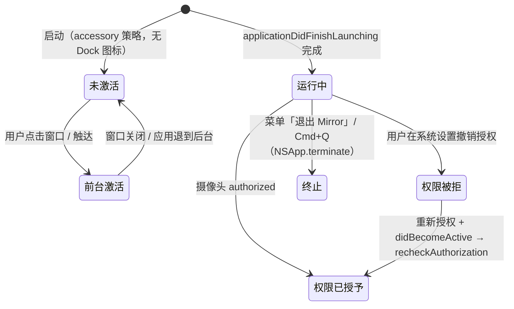

# 菜单栏入口与应用生命周期 领域知识库

## §0 目录索引

| § | 标题 | 定位 |
|---|------|------|
| §1 | 业务背景与核心概念 | 首次接触该域时读 |
| §1.5 | 架构概览 | 快速建立分层认知（mermaid 图） |
| §2 | 核心业务流程 / 状态机 | 理解菜单区分发与应用生命周期 |
| §2.5 | 物理路径速查 | 直接定位代码目录（可 glob/ls） |
| §3 | 代码入口索引 | 按任务场景找入口 |
| §4 | 持久化入口索引 | 改偏好存储 key 时 |
| §5 | 系统事件入口索引 | 改通知监听 / 状态同步时 |
| §6 | 核心业务规则与隐性约束 | 改代码前必扫的 AI 易错点 |
| §7 | 验证路径 | 改完后如何验证正确性 |
| §8 | 关联文档 | 跨域联读指引 |
| §9 | 覆盖度与待补充项 | 了解文档置信度和缺口 |

## §1 业务背景与核心概念

Mirror 是**菜单栏常驻应用**（`LSUIElement` 式 accessory 应用）：Dock 无图标、无菜单栏窗口，**唯一的常驻入口是状态栏图标**。本域负责：

- 状态栏图标的创建、图标渲染与点击分发（左键 = 开关镜像窗口，右键 = 弹菜单）；图标使用 App Icon 核心轮廓提炼出的黑色透明线稿模板图，不直接缩小彩色 App Icon；
- 菜单内容与状态同步：「显示 / 隐藏镜像」「水平镜像」勾选、开机自启、检查更新、「退出」；
- **登录项静默启动**：登录拉起时只就绪状态栏与会话，**不**自动 `showMirror()`；用户主动冷启动仍打开就看到镜子；
- **禁止隐藏菜单栏图标**：菜单与镜像窗均不提供隐藏/恢复图标入口；启动时强制图标可见；
- 应用启动装配（`@NSApplicationDelegateAdaptor` → `AppDelegate`）与激活策略（accessory 模式）；
- 应用生命周期观察：从系统设置返回（`didBecomeActive`）时自动重检摄像头权限。

主要概念与主称谓：

- **状态栏入口**（`StatusBarController`）：持有 `NSStatusItem`，负责图标、点击分发与菜单。
- **菜单栏菜单**（`NSMenu`）：显示/隐藏镜像（标题动态）、水平镜像（勾选态）、开机自启、检查更新、退出 Mirror。**不得**含「隐藏菜单栏图标」。
- **边界控制器**（`AppDelegate`）：应用入口，装配三个依赖（会话、窗口、菜单），并监听权限。状态栏与窗口、会话完全解耦（用闭包注入，见 §3）。
- **accessory 激活策略**：`NSApp.setActivationPolicy(.accessory)`，Dock 无图标、点窗口可激活但无常规菜单栏应用行为。
- **登录静默判定**（`LoginLaunchDetector.isLaunchedAsLoginItem`，MacKitLifecycle）：须在 `applicationDidFinishLaunching` 早期读取。

核心循环：用户在状态栏图标上**左键单击** → 若窗口不可见则 `toggleVisibilityHandler()`（即「显示镜像」）；**右键单击** → 弹出菜单（含标题与勾选状态）；窗口内双击同样回到隐藏。任何「显示镜像」动作本质上由窗口控制器落盘位置、启动采集会话（见采集域）。

## §1.5 架构概览

本域是纯 AppKit（无 SwiftUI 参与事件），核心是「状态栏 ↔ 闭包注入 ↔ 控制器」的单向装配：

```mermaid
graph TD
    A[MirrorApp.swift<br/>@main / App] -->|@NSApplicationDelegateAdaptor| B[AppDelegate]
    B -->|applicationDidFinishLaunching| C[NSApp.setActivationPolicy<br/>.accessory]
    B --> D[CameraSessionManager 创建]
    D --> E[observeCameraReactivation<br/>didBecomeActive→重检权限]
    B --> F[MirrorWindowController<br/>init sessionManager]
    F --> G[StatusBarController<br/>注入 4 个闭包]
    G --> H[statusItem.button<br/>App Icon 同款黑白透明线稿模板图]
    H -->|左键 rightMouseUp| I[openMirrorIfNeeded→toggleVisibilityHandler]
    H -->|右键或菜单弹出| J[menu.popUp 从 button 下方]
    J --> K[菜单项: 显示/隐藏镜像 toggleVisibilityHandler]
    J --> L[菜单项: 水平镜像 toggleMirroringHandler → sessionManager.toggleMirroring]
    K --> F
```

应用生命周期状态机：



## §2 核心业务流程 / 状态机

### 2.1 启动装配流程（`AppDelegate.applicationDidFinishLaunching`）

1. **尽早**读取 `LoginLaunchDetector.isLaunchedAsLoginItem`（Apple Event 稍后可能清空）。
2. `NSApp.setActivationPolicy(.accessory)` —— 关键：**必须在任何窗口展示前**设置，否则 Dock 图标与菜单栏应用方式不对（见 §6）。
3. 若 `MenuBarIconStore.isVisible == false`，写回 `true`（图标即唯一入口，禁止保持隐藏偏好）。
4. `CameraSessionManager()` 创建会话管理器（唯一实例，之后通过闭包共享）。
5. `observeCameraReactivation(sessionManager)`：注册 `NSApplication.didBecomeActiveNotification` 观察者，队列 `.main`，回调里 `Task { @MainActor sessionManager?.recheckAuthorization() }`（弱引用防泄漏，见 §6）。
6. `MirrorWindowController.init(sessionManager:)` 创建窗口控制器（此时不显示、也不得启动采集）。
7. `StatusBarController.init(...)`：注入闭包而非直接持对象引用，包括 `isVisible`、`toggleVisibility`（菜单显隐）、`showMirror`（左键/启动上屏）、镜像与开机启动、检查更新。状态项强制 `isVisible = true`。
8. **仅当非登录拉起**时调用 `windowController.showMirror()` —— 用户主动打开就要看到镜子；登录项拉起必须静默（零窗口）。

装配顺序即创建顺序；无显式依赖管理，全在 AppDelegate 方法内完成（本域规模小，不需要解耦容器）。

### 2.2 状态栏点击分发（`handleStatusItemClick`）

状态栏图标被点击（`sendAction(on: [.leftMouseUp, .rightMouseUp])` 覆盖左右键）：

- 取 `NSApp.currentEvent` 判断 **事件类型**：
  - `.rightMouseUp` → `showMenu(from: sender)`，弹菜单（从图标底部弹出）；
  - 其他（左键/中键/手势）→ `openMirrorIfNeeded()`。
- `openMirrorIfNeeded()`：左键一律 `showMirror()`（已显示则置顶）。不要用「已可见就什么都不做」——窗口可能处在未上屏的幽灵状态，再点图标会再也出不来。

### 2.3 菜单同步（`menuNeedsUpdate(_:)`）

`NSMenuDelegate.menuNeedsUpdate` 在**每次菜单即将弹出时**被调用，本域在此重写标题与勾选：

- `visibilityItem.title` = `isVisibleHandler() ? "隐藏镜像" : "显示镜像"`（标题随窗口状态双向切换）
- `mirroringItem.state` = `isMirroredHandler() ? .on : .off`（勾选「水平镜像」）

**重要语义**：菜单标题/状态不是静态文本，是**每次弹出时动态读取**。改菜单文案时必须同时改 `menuNeedsUpdate`，否则会显示过期状态。

### 2.4 菜单项动作

| 菜单项 | action | 效果 |
|---|---|---|
| 显示镜像/隐藏镜像（动态标题） | `toggleVisibilityHandler` | 显示/隐藏镜像窗口 |
| 水平镜像（勾选） | `toggleMirroringHandler` | 切换水平镜像偏好（UserDefaults key：`mirror.preview.isMirrored`，见摄像头域 KB） |
| 开机时启动 Mirror | `handleToggleLaunchAtLogin` | 开关登录项；待批准时引导系统设置 |
| 检查更新… | `checkForUpdatesHandler` | Sparkle 检查更新 |
| 退出 | `onQuit` → `TerminationGuard` | 退出应用 |

**禁止**：菜单不得出现「隐藏菜单栏图标」/ Hide Menu Bar Icon；镜像窗不得出现「显示菜单栏图标」开关。`MenuBarIconStore` 可保留内部实现，但对外不提供隐藏路径。

### 2.5 权限恢复观察（`observeCameraReactivation`）

系统权限恢复路径：用户在系统设置授权后，采集域会从多条入口自动重检（`didBecomeActive`、窗口变 key、降级态出现与轮询）。菜单栏应用经常收不到 active，**不能只靠这一条**。**无手动重试 UI**（这是本应用的既定语义：会话区不提供重试按钮）。

- 仅在 `.unauthorized` 状态下有意义（见采集 KB 状态机）；`.failed`（无摄像头/输入错误）不会因 active 而自动恢复。
- 观察者保存在 `cameraPermissionObserver` 属性防回收（实际上 `NotificationCenter.addObserver` 返回 token 并被持有，见 §6）。

## §2.5 物理路径速查

| 目录（相对项目根） | 内容 | 关键文件 |
|------|------|---------|
| `MirrorApp/` | 全部源码（单 target `Mirror` 的 sources 目录） | `StatusBarController.swift`（状态栏与菜单）、`AppDelegate.swift`（装配与生命周期）、`MirrorApp.swift`（应用声明） |
| `MirrorApp/Info.plist` | `LSUIElement = true`（菜单栏应用）与相机用途描述 `NSCameraUsageDescription` | 弹权限的文案；无 Dock 图标依赖此键 |
| `project.yml` | XcodeGen 工程定义（`LSUIElement` 在 Info.plist 由工程生成）| `bundleIdPrefix` / `deploymentTarget` / Swift 6 并发 |
| `Mirror.xcodeproj/` | 由 `xcodegen generate` 生成（禁止手改） | — |
| 外部 | `UserDefaults.standard`（系统域） | key 见 §4 |

本域无自有存储。所有偏好读写（镜像、窗口）都直接落 `UserDefaults.standard`（无自定义 suite，无 plist 文件，无网络）。

## §3 代码入口索引

| 场景 | 入口 | 类/方法/配置 | 说明 |
|---|---|---|---|
| 应用启动 | `MirrorApp.swift` | `App.main` → `@NSApplicationDelegateAdaptor` | SwiftUI App 入口，无 WindowGroup（真正的窗口是 AppKit 的） |
| 装配与启动 | AppDelegate | `AppDelegate.applicationDidFinishLaunching` | 建会话、窗口、菜单；设激活策略 |
| 状态栏点击 | StatusBar | `StatusBarController.handleStatusItemClick(_:)` | 左/右键分发 |
| 菜单弹出 | StatusBar | `StatusBarController.showMenu(from:)` | 右键 → `menu.popUp` |
| 菜单内容更新 | StatusBar | `StatusBarController.menuNeedsUpdate(_:)` | 弹出前动态同步标题/勾选 |
| 菜单项动作 | StatusBar | `handleToggleVisibility` / `handleToggleMirroring` / `handleQuit` | 三个 @objc 动作 |
| 显示/隐藏窗口 | 窗口控制器 | `MirrorWindowController.toggle()` | 闭包 `toggleVisibility` 指向它 |
| 镜像偏好切换 | 会话管理器 | `CameraSessionManager.toggleMirroring()` | 菜单「水平镜像」项动作指向它 |
| 权限恢复 | 会话管理器 | `CameraSessionManager.recheckAuthorization()` | 菜单不直接触发；窗口与降级态会轮询，不能只靠 active 通知 |
| 权限观察 | AppDelegate | `AppDelegate.observeCameraReactivation(_:)` | `didBecomeActive` 通知 |

## §4 持久化入口索引

本域**不直接写持久化**。菜单状态是运行时从窗口与会话管理器读取（`isVisible` / `isMirrored`）。菜单栏与镜像、镜像偏好的持久化分布在两个域：

| key | 类型 | 默认值 | 业务语义 | 改动注意 |
|---|---|---|---|---|
| `mirror.preview.isMirrored` | Bool | `true` | 水平镜像偏好 | 在会话管理器读写，菜单选是「实时回显」 |
| `mirror.window.origin.x/y`、`mirror.window.size` | Double | 无（首次无值） | 窗口帧持久化 | 窗口控制器在隐藏/移动时写，见窗口 KB |

菜单栏无 key，勾选态完全由运行时查询（`isMirroredHandler()`）驱动，**改菜单时不要在这里新增持久化**。

## §5 系统事件入口索引

| 类型 | 标识 | 代码入口 | 适用场景 |
|---|---|---|---|
| 系统通知 | `NSApplication.didBecomeActiveNotification` | `AppDelegate.observeActiveReactivation` | 从别处切回时重检权限 |
| 鼠标 | `NSApp.currentEvent` `.rightMouseUp` | `StatusBarController.handleStatusItemClick` | 右键弹菜单 |
| 菜单生命周期 | `NSMenuDelegate.menuNeedsUpdate` | `StatusBarController.menuNeedsUpdate` | 弹出前刷新状态 |
| 应用终止 | `NSApp.terminate(_:)` | `StatusBarController.handleQuit` | 菜单「退出」 |

不在本域: 窗口事件、采集会话事件（窗口 KB / 采集 KB）。

## §6 核心业务逻辑与隐性约束

- 【产品裁定 · 登录静默】**登录项拉起禁止 `showMirror()` / 打开设置类窗口**。判定只用 `LoginLaunchDetector.isLaunchedAsLoginItem`，不要用「是否登记了登录项」代替。用户主动冷启动与 reopen 仍可出示镜子。
- 【产品裁定 · 图标常驻】**图标即唯一主入口 → 禁止隐藏菜单栏图标**。不得在菜单或设置/恢复面提供 Hide / Show Menu Bar Icon；启动时强制 `statusItem.isVisible = true`，若偏好曾为 false 写回 true。
- 【禁止】**在非主线程访问菜单栏 / 状态栏项** -> 所有 UI 更新（标题、勾选、状态查询回调）必须发生在事件循环（主线程）；`NSMenuItem` 与 `NSStatusItem` 不是线程安全的。代码中 `isVisibleHandler` / `isMirroredHandler` 回调发生在主线程菜单路径，不需额外加锁，**不要**把菜单刷新逻辑放到后台线程。
- 【固定视觉规则】**菜单栏图标沿用 App Icon 的核心语义，但必须是独立的黑白透明模板图**：保留原 App Icon 的两张斜纸层、前层纸张边框、内页区域和三角形斜线之间的几何关系，不能用普通矩形和缺少一边的折线替代原图形；前层主体以足够厚的轮廓线表达，原图中的后层纸和投影可以用纯黑块面表达，不要求所有细节都描成线，避免 18×18 线条过密；尤其是斜三角内部和右下后层/投影等容易挤成密线的区域，直接使用纯黑填充，不使用灰阶或半透明阴影。删除黄色背景、纹理和高光。线条要有足够的视觉重量，禁止为了追求留白使用极细线；实际视觉重量不得明显低于同尺寸 Apple 系统菜单栏符号，校准时以 macOS 自带符号在相同尺寸下的观感为参照。Apple 官方没有给自定义菜单栏图标规定一个固定像素线宽，验收依据是与系统符号保持一致的 optical weight；小尺寸应通过减少线条数量和内部细节来留白，而不是把保留的线继续变细。本轮以 macOS 18 pt 的 SF Symbol `doc.on.doc` 在 `medium` 到 `semibold` 重量之间作为视觉参照。非透明像素 RGB 必须为纯黑，层次只能用透明区域与必要的抗锯齿 alpha 表达，并通过 Asset Catalog 的 `template` 渲染意图交给系统在浅色 / 深色菜单栏中着色。18×18 显示时应先看到清楚的纸张轮廓、后层关系、纯黑斜三角和透明留白，而不是一整块黑色。禁止把完整彩色 App Icon 等比缩小、机械灰度化或阈值填黑。
- 【禁止】**挂 statusItem.menu 属性**——菜单通过 `menu.popUp` 手动弹出，`statusItem.button.menu` **从未被赋值**（设置按钮 `target`/`action` 后手动分发）。若把 `statusItem.menu = menu` 这样的 Api 加回，状态栏图标会变成「点击弹菜单」而不是「左键即开镜像」——这违反本应用「左键直达开关」的核心语义（见注释块）。**AI 易错点**：习惯性把 `statusItem.menu` 赋值是常见回退，必须保持 `popUp` 手动分发方式。
- 【禁止】**手写 `CameraAuthorization` 逻辑到菜单域** -> 权限检查/重检统一在 `CameraSessionManager`，菜单只读 `isMirrored` 与切换回调。避免在菜单代码里直接引用 `AVCaptureDevice`。**AI 易错点**：在菜单项 action 里做权限判断极易造成状态不一致（菜单只做状态查询转发）。
- 【隐式依赖】**`didBecomeActive` 与重检的串行关系**：`observeCameraReactivation` 的回调包裹 `Task { @MainActor }`，即每次 `didBecomeActive` 都会 `recheckAuthorization()`，而权限状态从 `unauthorized` → 恢复必须经过这个入口。**如果新增「恢复」路径（如菜单项手动重检），必须走 `recheckAuthorization()` 而不是直接 `start()`**（start 在 unauthorized 态直接返回，见采集 KB）。
- 【消歧】**「显示镜像」菜单标题 vs 勾选「水平镜像」**：菜单标题动态（`显示/隐藏镜像`）由窗口可见性（`isVisibleHandler()`）决定；菜单项不写偏好存储，勾选「水平镜像」对应会话管理器的镜像偏好（`isMirroredHandler()`/`toggleMirroringHandler()`）。两者源不同，别用镜像偏好给「显示镜像」做勾选。
- 【隐式依赖】**应用退出路径**：菜单「退出」`NSApp.terminate(nil)`；因激活策略是 accessory，应用退出后**不会自动保存任何未持久化状态**（持久化发生在每次窗口移动/隐藏时由窗口控制器写盘，见窗口 KB）。所以新增「退出时需保存」的需求不要在这里写逻辑，而去窗口域。
- 【低置信度】`menu.popUp` 的 `popUp(positioning:at:in:)` 中定位 `y = button.bounds.height + 2`（图标下方）；在双屏/高分缩放屏可能偏移像素 1 个点，尚未在真实双屏环境验证（证据：`showMenu` 实现；待用户在双显示器场景确认）。
- 【规约参考】活动感知机制（`didBecomeActive`）是可复用模式：项目内其他应用（JotBox 等）在加到 Mirror 时可直接复用本入口模式（AppDelegate `observe*` 函数 + `NotificationCenter.addObserver(forName:queue:using:)`）。

## §7 常见易忽略条件与验证路径

- 改菜单栏后：重启应用（`pkill -x Mirror || true` → 启动），检查：
  - 状态栏图标正常出现（App Icon 同款黑白透明模板图）；浅色 / 深色菜单栏均能清晰辨认，且不显示黄色底、阴影或灰色脏边；
  - **左键**单击图标 → 镜像窗立即显示/隐藏（而不是弹菜单）；
  - **右键**单击 → 菜单弹出；标题为「隐藏镜像」时表示当前可见，勾选框与「水平镜像」开关一致；**菜单无「隐藏菜单栏图标」**。
  - 用户主动冷启动：镜像窗自动出现；登录项拉起（重新登录真机）：仅状态栏就绪、无镜像窗（可标未测若未重登）。
- 权限恢复链路（联动采集域 §7）：
  ```bash
  tccutil reset Camera com.x0c.mirror    # 重置权限
  # 重启 Mirror → 窗口内应显示「未获得摄像头权限」+「打开系统设置」按钮
  # 打开系统设置对此应用开启摄像头 → 不必点镜子、也不必特意切回前台
  # → 约 1 秒内画面自动恢复（降级态轮询 recheckAuthorization）
  ```
  注意：只有「权限被拒」态走这条链路；无摄像头（failed）不恢复。
- 菜单状态一致性：窗口可见时打开菜单（应显示「隐藏镜像」），用其他方式隐藏窗口（如双击窗口）后再次打开菜单（应显示「显示镜像」）——两步是对同一个 `isVisible` 事实源。
- 编译与启动走根 AGENTS.md §3 固定流程（构建、替换 /Applications、拉起、pgrep 校验）；每个菜单/交互改动都要手动过一遍 5 个链路（左键开来回、右键菜单、勾选开关、退出、权限恢复）。

## §8 关联文档

- `CAMERA_SESSION_KNOWLEDGE_BASE.md`：菜单项「水平镜像」与权限状态机的联动（`CameraSessionManager.toggleMirroring` / `recheckAuthorization` 行为、`unauthorized` 态的 start 短路）。
- `MIRROR_WINDOW_KNOWLEDGE_BASE.md`：`toggle()` 与 `hideMirror()` 的窗口行为、窗口持久化交互见窗口 KB；菜单与窗口的「isVisible 为准」约定在两侧共同。
- [Apple Human Interface Guidelines — Icons](https://developer.apple.com/design/human-interface-guidelines/icons)：菜单栏模板图按“高度简化、黑色与透明定义形状、避免极细线”的官方原则制作；小尺寸应删减细节，不以继续减细线宽换留白。

## §9 覆盖度与待补充项

- 代码推断覆盖：启动装配（task 1）、菜单项与弹窗（2.2/2.3）、权限观察（2.5）、菜单点击分发（2.2）均基于 `StatusBar.swift`、`AppDelegate.swift`、`MirrorApp.swift` 直接推断。
- 领域语言统一：主称谓「状态栏入口 / 菜单栏 / 菜单项」；代码侧 `StatusBar`、`NSMenu` 与之对应；「显示/隐藏镜像」与窗口 `toggle` 一一对应。
- 用户 / 资料补充：暂无（本次 doc-init 未做 Intake 访谈）。
- 多源证据补强：README 提及「菜单栏应用」；`project.yml` 确认单 target / accessory 模式；Git 仅初始提交。
- Q&A 补充：0 条（未执行人机问答）。
- 待确认：
  - `menu.popUp` 在双屏高 DPI 环境的最小偏移（低置信度，需真机）。
  - 应用是否需要在全局注册「显示/隐藏」快捷键（代码无此功能，仅状态栏图标可达）。

<!-- 该文档由 doc-init 生成于 2026-08-08；定位：AI 修改本业务域前的快速参考文档 -->
