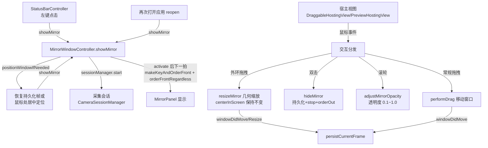
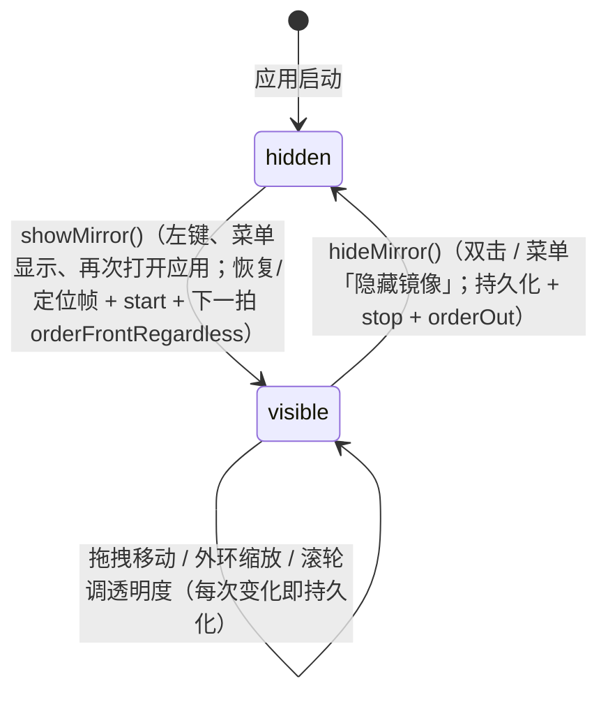
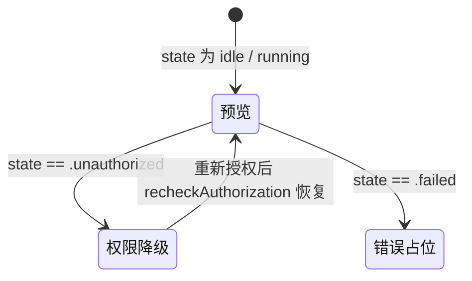

# 镜像窗口与交互 领域知识库

## §0 目录索引

| § | 标题 | 定位 |
|---|------|------|
| §1 | 业务背景与核心概念 | 首次接触该域时读 |
| §1.5 | 架构概览 | 快速建立分层认知（mermaid 图） |
| §2 | 核心业务流程 / 状态机 | 理解窗口显隐、交互分区、几何缩放机制 |
| §2.5 | 物理路径速查 | 直接定位代码目录（可 glob/ls） |
| §3 | 代码入口索引 | 按任务场景找入口 |
| §4 | 持久化入口索引 | 改窗口偏好存储 key 时 |
| §5 | 系统事件入口索引 | 改窗口事件监听 / 鼠标交互时 |
| §6 | 核心业务规则与隐性约束 | 改代码前必扫的 AI 易错点 |
| §7 | 常见易忽略条件与验证路径 | 改完后如何验证正确性 |
| §8 | 关联文档 | 跨域联读指引 |
| §9 | 覆盖度与待补充项 | 了解文档置信度和缺口 |

## §1 业务背景与核心概念

镜像是用户看到的唯一主界面：一个无边框、透明背景、圆形裁剪的前置摄像头预览小窗，悬浮在所有普通窗口之上（`.floating` 层级），可拖拽、可按外缘缩放、可滚轮调透明度，位置与透明度会被持久化，下次打开时恢复到上次的状态（前提仍在某块可见屏幕内）。

本域负责：

- 镜像窗口（`MirrorPanel`）的创建、显示、隐藏、层级与空间行为（跨 Space、全屏辅助）；
- 命中热区判定与三类手势：拖动窗口、环形边缘缩放、滚轮调透明度；
- 「双击隐藏」这一全局快捷行为（窗口上任意位置双击即隐藏并停止采集）；
- 窗口几何（位置 / 尺寸 / 透明度）的 UserDefaults 持久化与恢复，含离屏兜底重定位；
- 采集状态到窗口内容的分流渲染（权限降级态 / 错误占位 / 实时预览）；
- 圆形裁剪的视觉呈现（多层组合实现，见 §6）。

主要实体与主称谓：

- **镜像窗口**（`MirrorPanel`，`NSPanel` 子类）：边框矩形为正方形（初始化 280×280，缩放范围 160–520），但视觉上是圆形（内容被裁圆）。
- **交互环**：窗口外环一圈的缩放热区（见 §2 命中判定），环内为拖动热区。
- **几何持久化**：窗口位置 / 尺寸 / 透明度存 UserDefaults（key 见 §4）。
- **预览视图**（`PreviewHostingView`）：承载 `AVCaptureVideoPreviewLayer` 的宿主视图，负责圆形蒙层与水平镜像。
- **窗口内容**（`MirrorContentView`）：按采集会话状态（`CameraSessionManager.state`）分流渲染三种内容。

本域是采集域的渲染层：窗口显示时采集会话启动，窗口隐藏时采集会话停止——两者生命周期耦合，见 §8 与采集知识库。

## §1.5 架构概览

三层结构：`MirrorWindowController`（窗口控制 / 状态 / 持久化）↔ `MirrorContentView`（SwiftUI 内容分流）↔ `PreviewHostingView`（NSView / AV 预览层）。交互事件由宿主视图（`DraggableHostingView` / `PreviewHostingView`）捕获后上抛给窗口控制器处理。



窗口状态机（显隐为二态，无动画过渡）：



内容视图的分流（`MirrorContentView.content`）按采集状态渲染：



## §2 核心业务流程 / 状态机

### 2.1 命中热区判定（核心交互分区）

视觉是圆形，**交互热区也是按圆的几何判定**（`isInResizeRing` 用圆心距离判断，不是矩形边框）：

- **缩放热区**：以窗口中心为圆心的**环形带**——距离中心 `≥ (半径 − 边缘厚度)` 且 `≤ 半径`。半径 = `min(宽, 高) / 2`（即内切圆半径）；边缘厚度 `edgeWidth = min(max(宽度 × 0.12, 18), 32)`，所以 280px 窗口热区厚约 32px，160px 时 18px。
- **拖动热区**：圆心距离 `< (半径 − 边缘厚度)` 的中心盘区域（含圆内的全部画面）。
- **圆外四个角落**：既不在缩放环内也不在拖动盘内 → `mouseDown` 落到 `window.performDrag(with:)`，仍可拖窗口（本质是统一的拖动处理）。**改热区几何时注意：角落走的是移动分支，不是缩放分支**。
- **双击**：窗口上任意位置双击即隐藏并停止采集。
- **滚轮**：窗口内任意位置滚动调整透明度（无精确滚轮时步进更大）。

### 2.2 显示流程（`showMirror()`）

1. `positionWindowIfNeeded(window)`：见 2.4 定位逻辑。
2. `sessionManager.start()`：启动采集（详见采集知识库）。**禁止**在 SwiftUI `onAppear` 里启动——宿主视图在窗口 `orderOut` 时也会 onAppear，会把摄像头打开但窗口仍在屏幕外（表现为指示灯亮、看不见镜子）。
3. `NSApp.activate(ignoringOtherApps: true)`：把应用拉到前台（无 Dock 图标的 accessory 应用必须主动激活）。
4. **下一个 runloop** 再 `window.makeKeyAndOrderFront(nil)` + `window.orderFrontRegardless()`：菜单栏应用必须错开一拍，否则窗口会排到别的应用后面甚至不上屏。

菜单栏左键、菜单「显示镜像」、以及再次打开应用（`applicationShouldHandleReopen`）才走 `showMirror()`，不走 `toggle()`。`toggle()` 只给菜单「显示/隐藏镜像」。**冷启动与登录项装配结束时禁止调用 `showMirror()`**（见菜单栏入口 KB「启动只就绪」）。

### 2.3 隐藏流程（`hideMirror()`）

1. `persistCurrentFrame()`：落盘当前位置 / 尺寸 / 透明度。
2. `sessionManager.stop()`：停止采集。
3. `window.orderOut(nil)`：隐藏；窗口不释放（`isReleasedWhenClosed = false`），下次直接复用。

隐藏后再次显示走 2.2（不会重新初始化窗口对象）。

### 2.4 定位流程（`positionWindowIfNeeded()`）

优先级：

1. `restorePersistedFrameIfPossible()`：若持久化帧存在且与任一 `NSScreen.screens[i].visibleFrame` 相交 → 恢复并置 `hasPositionedWindow = true`，结束。
2. 否则，满足 `!hasPositionedWindow || 窗口离屏 || 原点为 (.zero)` 时进入自动定位：取**鼠标所在屏幕**的 `visibleFrame`，让窗口中心对齐鼠标位置，再钳制到可见区域内（`window.setFrameOrigin`）。
3. 兜底（无屏幕/取不到鼠标屏幕）：`window.center()`。

`hasPositionedWindow` 保证只首次（或离屏后）自动定位，用户手动拖动后不再干预。

### 2.5 缩放交互状态机（核心算法）

缩放交互是**环形边缘拖拽**，由 `MirrorWindowController` 与宿主视图协同完成：

**本域关键约束：拖拽缩放时窗口中心保持不变**（`centerInScreen` 固定），尺寸和原点同步移动，这也是 `alignedToBacking` 对齐像素的原因。

`MirrorResizeState` 承载一次缩放过程中的几何快照：

| 字段 | 含义 | 更新时机 |
|---|---|---|
| `referenceSize` | 缩放前窗口尺寸 | 每次成功 resize 后同步 |
| `centerInScreen` | 缩放前窗口中心（屏幕坐标） | 不变（本域关键语义） |
| `resizeAxis` | 缩放方向单位向量 | 不变 |
| `referenceProjectedDistance` | 初始时鼠标向量在这条轴上的投影长度 | 每次成功 resize 后同步 |
| `cursor` | 该边缘的缩放光标 | 不变 |

流程：

1. 宿主视图 `mouseDown`：若是外环热区 → `beginInteractiveResize()` 置 `isInteractiveResizeInProgress = true`（**告诉窗口控制器忽略期间的位置回写**，见 2.6），并构造 `MirrorResizeState`。
2. 宿主视图 `mouseDragged` → `window.resizeMirror(using:state:)`：
   - 计算鼠标向量投影与参考投影之差 `delta`；
   - 新尺寸 `referenceSize + delta * 2`（双向生长，除以 2 是边匹配）钳制到 `[minSize=160, maxSize=520]`；
   - `alignedToBacking`：按 `backingScaleFactor` 对齐到屏幕像素，避免亚像素模糊；
   - `setFrame(display:false)` 更新原点与尺寸（中心位置不变）。
3. 宿主 `mouseUp` → `endInteractiveResize()`：清除标志、落盘最终帧。

注意：每次 `mouseDragged` **都重新计算 resize 状态**（`MirrorResizeState` 会被覆盖），但因为 `centerInScreen` 不变，实际是稳定迭代。**改缩放算法时不要动 `centerInScreen` 的固定语义**。

### 2.6 位置持久化抑制（`isInteractiveResizeInProgress`）

`resizeMirror` 直接调 `window.setFrame(...)`，会触发 `windowDidMove` / `windowDidResize` 窗口回调。这两个回调内部会 `persistCurrentFrame()`，会把**拖动中间过程**的几何值写入 UserDefaults。因此：

- `beginInteractiveResize()` 置标志 → 拖动期间 `windowDidMove` / `windowDidResize` 看到标志为真 → **跳过落盘**；
- `endInteractiveResize()` 清标志并显式落盘一次（以最终帧为准）。

这是防抖设计：不依赖中间帧，只在手势结束落盘。**加新回调字段时注意这个标志的语义**。

### 2.7 透明度调节（`adjustMirrorOpacity`）

- 窗口任意位置滚动鼠标滚轮即调透明度，范围钳制 `[0.1, 1.0]`；
- `hasPreciseScrollingDeltas`（妙控鼠等高精度设备）时变化更细（`0.01/3`），否则 `0.08/3`；
- **立即**写 `UserDefaults` key `mirror.window.alpha`（不等 `windowDidEndLiveResize`）。

### 2.8 圆形裁剪与预览

- 内容层：`MirrorContentView` 套 `GeometryReader` + `.clipShape(Circle()).contentShape(Circle())` 裁成圆形命中区域；
- 预览层：`PreviewHostingView`（`AVCaptureVideoPreviewLayer`）`layer.masksToBounds = true`，在 `layout()` 中设 `cornerRadius = bounds.width / 2`，配合 `AVCaptureVideoPreviewLayer.videoGravity = .resizeAspectFill` **镜像适应填满** 圆形画面。

视图层级：`MirrorPanel.contentView = DraggableHostingView`（NSHostingView，承载整个 SwiftUI 内容 → `MirrorContentView` → 产出 `CameraPreviewView`）→ 内部 `PreviewHostingView`（NSView，悬挂 `AVCaptureVideoPreviewLayer` 预览层）。**`DraggableHostingView` 与 `PreviewHostingView` 各自实现了一套相同的鼠标交互（mouseDown/mouseDragged/mouseUp/scrollWheel/双击）**：默认态命中 `PreviewHostingView` 的分发，非预览态（权限降级/错误占位）命中 `DraggableHostingView` 的分发。**改任何交互行为必须同步改两处，否则窗口两种内容状态下手势行为不一致。**

## §2.5 物理路径速查

本域代码全部位于单个 target 的 sources 目录 `MirrorApp/` 下：

| 目录（相对项目根） | 内容 | 关键文件 |
|------|------|---------|
| `MirrorApp/` | 全部源码（单 target `Mirror`） | `MirrorWindowController.swift`（窗口与交换逻辑）、`CameraPreviewView.swift`（预览层） |
| `MirrorApp/Info.plist` | `NSCameraUsageDescription` 相机用途描述 | 权限弹窗文案 |
| `project.yml` | XcodeGen 工程定义（唯一工程真实来源） | `bundleIdPrefix` / `deploymentTarget` / Swift 6 并发 |
| `Mirror.xcodeproj/` | 由 `xcodegen generate` 生成的工程（禁止手改） | — |

不涉及数据库 / 网络 / 文件写入。

## §3 代码入口索引

| 场景 | 入口 | 类/方法/配置 | 说明 |
|---|---|---|---|
| 窗口创建与展示 | 窗口控制器 | `MirrorWindowController.init(sessionManager:)` | 构建 `MirrorPanel`、`DraggableHostingView`、`MirrorContentView` |
| 显示/隐藏切换 | 窗口控制器 | `MirrorWindowController.toggle()` | 仅菜单「显示/隐藏镜像」 |
| 显示镜子 | 窗口控制器 | `MirrorWindowController.showMirror()` | 左键、菜单显示、再次打开应用；先定位再开采集再上屏；**禁止**冷启动自动调用 |
| 隐藏窗口 | 窗口控制器 | `MirrorWindowController.hideMirror()` | 双击 / 菜单「隐藏窗口」调用 |
| 定位窗口 | 窗口控制器 | `MirrorWindowController.positionWindowIfNeeded()` | 恢复持久化帧或按鼠标居中定位 |
| 位置持久化 | 窗口控制器 | `MirrorWindowController.persistCurrentFrame()` | 写 `UserDefaults` 4 个 key |
| 位置恢复 | 窗口控制器 | `MirrorWindowController.restorePersistedFrameIfPossible()` | 校验帧与可见屏幕相交 |
| 几何缩放 | 窗口控制器 | `MirrorWindowController.resizeMirror(using:state:)` | 缩放算法，中心固定的关键语义 |
| 透明度调节 | NSWindow 扩展 | `NSWindow.adjustMirrorOpacity(with:)` | 滚轮调透明度 |
| 窗口事件 | 窗口控制器 | `MirrorWindowController.windowDidMove/_windowDidResize/_windowDidEndLiveResize` | 事件驱动持久化（缩放中抑制） |
| 缩放命中判定 | NSView 扩展 | `NSView.isInResizeRing` / `NSView.resizeHandle(at:)` | 环形热区判定（§2.1） |
| 预览宿主视图 | `CameraPreviewView.swift` | `PreviewHostingView` | `AVCaptureVideoPreviewLayer` 管理与镜像 |
| 圆圈裁剪 | `MirrorWindowController.swift` | `MirrorContentView` | `GeometryReader` + `clipShape` |

## §4 持久化入口索引

UserDefaults 键（`MirrorPersistenceKey` 常量集中在 MirrorWindowController.swift 顶部）：

| key | 类型 | 默认值 | 业务语义 | 改动注意 |
|---|---|---|---|---|
| `mirror.window.origin.x` | Double | 无（首次无值） | 窗口记录原点的 x | 用 `object(forKey:) != nil` 判断首次，避免把「未设置」误读为「0」 |
| `mirror.window.origin.y` | Double | 无 | 窗口记录原点的 y | 同上 |
| `mirror.window.size` | Double | 无 | 窗口边长（正方形） | 恢复时钳制到 `[160, 520]`；不要用宽高分离存储 |
| `mirror.window.alpha` | Double | 无（default `1.0`） | 窗口透明度 | 钳制 `[0.1, 1.0]`；拖拽过程中也即时写入 |

注意：`origin` 与 `size` 三个 key 同时存在才尝试恢复（`object(forKey:)` 判空）；`alpha` 单独存在任何时刻都有效。默认尺寸 280×280 只在**没有持久化**时生效。

## §5 系统事件入口索引

| 类型 | 标识 | 代码入口 | 适用场景 |
|---|---|---|---|
| 鼠标 | `mouseDown` | `DraggableHostingView` / `PreviewHostingView` | 单击拖动窗口 / 外环缩放 / 双击隐藏 |
| 鼠标 | `mouseDragged` | 宿主视图（同上一对类） | 缩放过程中更新帧 |
| 鼠标 | `mouseUp` | 宿主视图 | 结束缩放并清状态 |
| 滚轮 | `scrollWheel` | 宿主视图 | 调透明度 |
| 窗口 | `windowDidMove` | `MirrorWindowController.windowDidMove` | 移动后持久化 |
| 窗口 | `windowDidResize` / `windowDidEndLiveResize` | `MirrorWindowController` 对应方法 | 缩放过程中持久化（受 `isInteractiveResizeInProgress` 抑制） |
| 采集 | `AVCaptureSession` 状态 | `MirrorWindowController`（经 `sessionManager`） | 窗口隐藏/显示与采集会话启停联动 |

无系统音量 / 通知中心 / 屏幕保护相关事件。

## §6 核心业务规则与隐性约束

- 【禁止】**只在预览层刚创建时设置一次水平镜像** -> `previewLayer.connection` 在采集 `startRunning` 之前是 nil，此时写入会被丢掉。菜单勾选来自偏好，画面要等连接建好再设一次。必须在 `AVCaptureSessionDidStartRunning`、`layout` 和 SwiftUI `updateNSView` 里**无条件**调用 `updateMirroring()`：默认就是开，SwiftUI 再赋同一个 `true` 时 `didSet` 会跳过，只靠属性变化永远套不上。连接未就绪时用图层水平翻转兜底，就绪后改回 `isVideoMirrored` 并清掉图层变换，避免翻两次。Swift 6：会话开始通知的观察 token 标 `nonisolated(unsafe)`，回调里用 `Task { @MainActor in }` 再设镜像，否则 `deinit` / 通知块编不过。
- 【禁止】**在 SwiftUI `onAppear` 里启动采集** -> 窗口控制器在启动时就会把宿主视图装上，此时窗口尚未 `orderFront`。`onAppear` 仍会触发，造成「摄像头指示灯亮着、镜子不在屏幕上」。采集只允许由 `showMirror()` 启动，由 `hideMirror()` 停止。
- 【禁止】**窗口未要求出画面时因权限轮询而 `start()`** -> `recheckAuthorization()` 必须先看 `isPreviewRequested`；隐藏镜子后这条标志为 false。
- 【禁止】拖动缩放期间执行额外 `persistCurrentFrame()` —— `beginInteractiveResize()` 之后 `windowDidMove` / `windowDidResize` 会被 `isInteractiveResizeInProgress` 抑制。**若在回调里无条件落盘，会把中间帧（拖到一半）的几何写死，导致之后打开窗口位置/尺寸错位**。
- 【禁止】在 `resizeMirror` 内使用 `setFrame(_:display:)` 默认值 `display=true` —— 单元帧更新应 `display:false` + 依赖系统合成，否则缩放过程重绘闪烁。代码路径 `MirrorWindowController.resizeMirror` → `window.setFrame(NSRect(origin:size:), display:false)`。
- 【隐式依赖】先判 `hasPositionedWindow` 再决定是否自动定位 —— 用户手动拖过之后（`hasPositionedWindow = true`），只有「窗口离开所有可见屏幕」或「原点为 zero」才重新自动定位；改定位逻辑时不要破坏这个「尊重用户手动摆放」语义。
- 【隐式依赖】透明度 range `[0.1, 1.0]` 在**两个位置**均有钳制：`adjustMirrorOpacity` 与 `restoredMirrorOpacity`（恢复持久化时也要钳制，防止非法值）。新增透明度交互路径时两处都要过钳制。
- 【消歧】**环形热区 vs 圆形画面**：命中是矩形边框内的一圈（含圆外四角），不是视觉圆环。App 视觉上是圆形，但交互判定按 320 见方（默认）的外缘一圈走——改交互逻辑时别按画面圆形想象热区形状。**AI 易错点**：把缩放手势接到 `clipShape(Circle())` 的视觉圆上会导致四角不可缩放、中心区域误判等。
- 【隐式语义】`NSPanel` 的 `window.isMovableByWindowBackground = false`，拖动完全由自定义 hit-test 分发；不要依赖系统标题栏拖动（窗口是 borderless，无标题栏）。
- 【低置信度】缩放锁掘上限 `maxSize = 520` 的演进依据未定：当多显示器 + 高分屏场景是否应该允许更大尺寸没有代码级结论（证据：`MirrorResizeState.maxSize` 常量；待确认：是否针对 Retina backing scale 放大上限）。
- 【隐式语义】`window.orderFrontRegardless()` 与 `window.makeKeyAndOrderFront` 都调用，且必须在 `NSApp.activate` **之后的下一拍**——因为此窗口 `level = .floating`，菜单栏应用当场 orderFront 常不上屏。删除任一或改回同步调用都会再现「指示灯亮、看不见镜子」。

## §7 验证路径

- 手势验收：
  - 拖动：按住窗口「圆外椭圆形区域」拖动——窗口跟随移动；松手后再次打开，位置应是上次位置。
  - 缩放：用妙控板/鼠标在窗口边缘按住拖动——窗口中心不动、尺寸 160~520 变化；到上限/下限再拖无跳动。
  - 透明度：滚轮滑动，窗口透明度 10%~100% 变化，写入后关闭重开保持。
  - 双击任意处→窗口隐藏且采集停止（`pgrep -x Mirror` 与 stderr 观察）。
- 持久化验收：
 ```bash
 # 开镜 → 拖到某位置并缩放 → 隐藏 → 重开
 defaults read com.x0c.mirror | grep mirror.window   # 应为最近一次非中间帧
 # 再把窗口拖出显示器到不可见区域 → 重开 → 应回到屏幕内
 ```
- 离屏兜底验收：把窗口拖到显示器外再打开 → 自动回到鼠标所在屏幕。
- 构建验收：`DEVELOPER_DIR=/Applications/Xcode.app/Contents/Developer xcodebuild -project Mirror.xcodeproj -scheme Mirror -configuration Debug -derivedDataPath .build build`。
- 运行验收（按根 AGENTS.md §3 固定流程）：替换 `/Applications/Mirror.app` 后启动并 `pgrep -fal` 校验进程；再点状态栏图标瞬时出现矩形窗口，圆形画面即时更新。
- 水平镜像验收：偏好为开时冷启动，菜单勾选为开且**第一帧就是左右翻转**；不要再关一次再开才翻转。

## §8 关联文档

- `CAMERA_SESSION_KNOWLEDGE_BASE.md`：本域所有渲染都依赖采集会话的 `state`；`MirrorContentView` 按 `state` 分流，窗口隐藏/停止采集与显隐联动。改本域时必须同步理解采集状态机与 `start/stop` 实现的线程边界。
- `MENU_BAR_ENTRY_KNOWLEDGE_BASE.md`：菜单栏「显示/隐藏镜像」调 `toggle()`、滚轮在窗口内而非在菜单事件（注意：透明度调节写在窗口宿主内，不依赖菜单）。改显隐链路时两边一致性。

## §9 覆盖度与待补充项

- 代码推断覆盖：窗口创建与生命周期（2.2/2.3）、定位（2.4）、缩放（2.5）、持久化（2.6）、透明度（2.7）、圆形裁剪（2.8）全部从 `MirrorWindowController.swift` 与 `CameraPreviewView.swift` 直接推导。
- 领域语言统一：主称谓「镜像窗口 / 拖动 / 缩放 / 透明度 / 位置恢复」；代码侧 `isVisible`、`persistCurrentFrame`、`MirrorResizeState` 等名词对应。
- 用户/资料补充：无（未人机访谈）。
- 多源证据补强：`project.yml`（单 target 配置与 Swift 6 设置）；`README` 确认「拖动 / 滚轮调透明度 / 双击隐藏」的用户可见描述；无测试代码。
- Q&A 补充：0 条（未执行人机问答）。
- 待补充：缩放上限 520 是否对大屏 Retina 场景足够（用户决策）；`NSScreen.screens` 首屏命名顺序在多显示器下的行为（代码用 `first(where:)` + `NSScreen.main` 兜底，未做 post-key 校验）；无自动化测试覆盖手势路径。

<!-- 该文档由 doc-init 生成于 2026-08-08；定位：AI 修改本业务域前的快速参考文档 -->